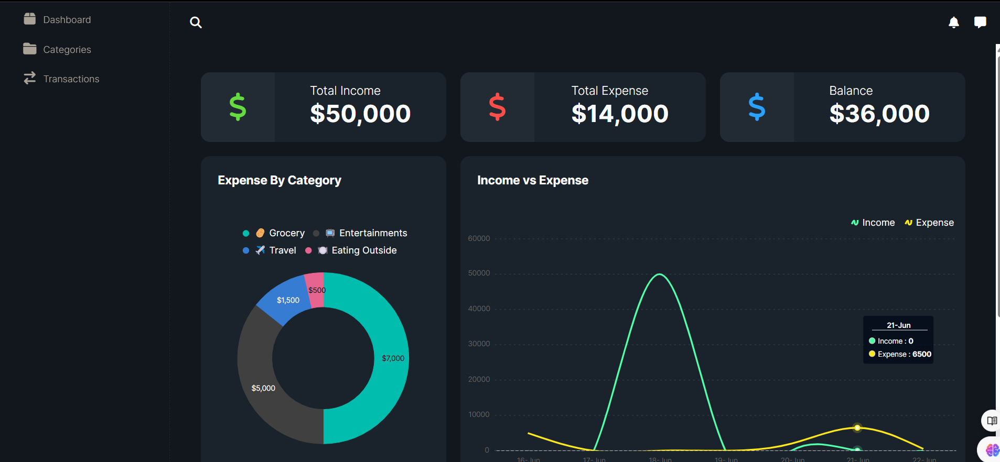
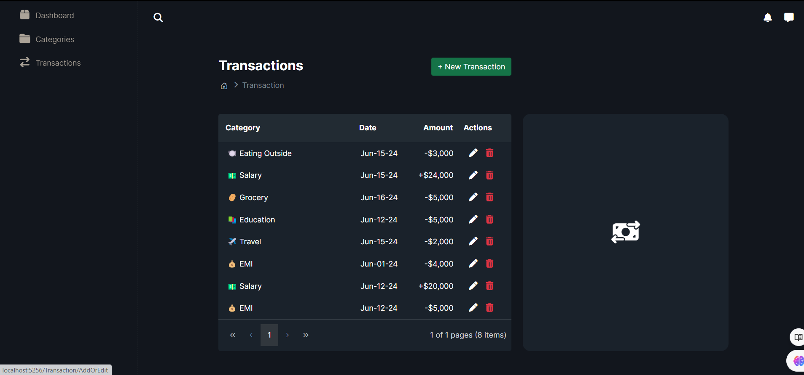

<h1>Expenditure and Income Tracker</h1>
<h3>This ASP.NET Core application simplifies the way you track your expenditures and earnings.<h3>

<h1>Features</h1>

Custom Categories: Create your own categories for both expenses and income types.

Add Transactions: Easily add transactions to keep track of your financial activities.

Visual Tracking: Utilize multiple charts to visualize your expenses and income.

Navigation: Use the sidebar for seamless navigation through the application.

Edit and Delete: Enjoy the functionality to edit or delete your categories and transactions.

<h1>Getting Started</h1>
<h2>Clone the Repository:</h2>

<h3>Bash </h3>
git clone https://github.com/yourusername/expenditure-income-tracker.git 
cd expenditure-income-tracker 

<h2>Setup:</h2>

  
Ensure you have .NET Core SDK installed. 
Restore the dependencies: 
<h3>Bash </h3>

dotnet restore 

<h2>Run the Application: </h2>

  <h3>Bash</h3>

dotnet run 
<h2>Navigate: </h2>

Open your browser and navigate to http://localhost:5000 to start using the application.

<h2>Usage</h2>

Create Categories: Navigate to the 'Categories' section to add new categories for your expenses and income. 
Add Transactions: Go to the 'Transactions' section to add your financial transactions. 
View Charts: Access the 'Reports' section to visualize your financial data through various charts. 
Manage Data: Use the sidebar to navigate through different sections and manage your categories and transactions. 

<h2>Feel free to modify the URLs and any other details specific to your project. </h2>
